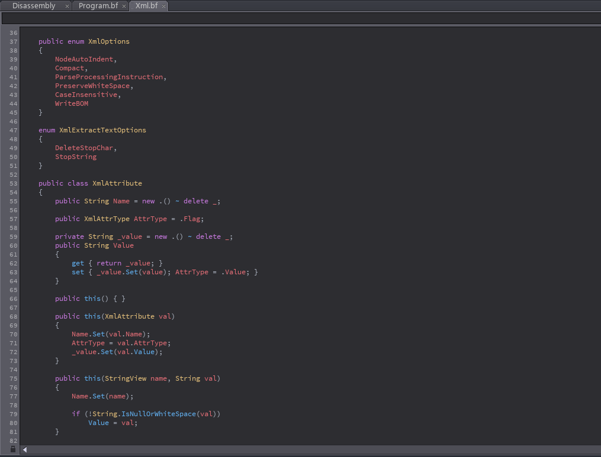

# One Dark Pro - BeefLang IDE theme
This theme closely resembles Atom's iconic One Dark theme

##### Editor

##### Disassembler

## Installation
- Download the release
- Extract the archive into your IDE's theme directory ( __C:\Program Files\BeefLang\bin\themes__ ), you might need to create the "themes" directory
- Configure the style's name in your settings. ( Under __File -> Preferences -> Settings__ edit the "Theme" value in the "ui" settings )
